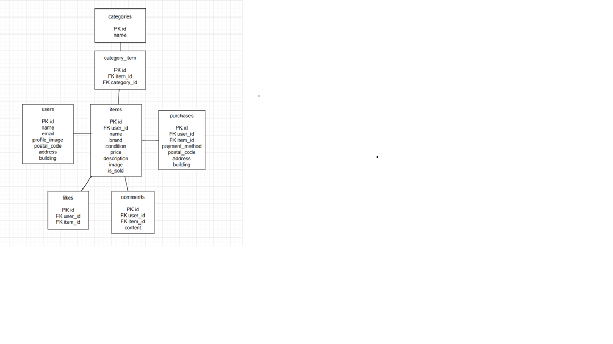

# coachtechフリマアプリ

## アプリ概要

フリマサービスを模したECアプリです。

ユーザー登録・ログイン機能、商品出品機能、商品購入機能、いいね機能、コメント機能、プロフィール機能を実装しています。

---

## 使用技術

- PHP 8.4.21
- Laravel 13.2.0
- MySQL 8.0
- Laravel Fortify
- Nginx
- Docker Compose
- phpMyAdmin
- MailHog

---

## 機能一覧

- 会員登録
- ログイン
- ログアウト
- メール認証
- プロフィール編集
- 商品一覧表示
- 商品詳細表示
- 商品検索
- いいね機能
- コメント機能
- 商品購入
- 配送先変更
- 支払い方法選択
- 商品出品
- 出品商品一覧表示
- 購入商品一覧表示

---

## URL

- 開発環境：http://localhost:8080
- phpMyAdmin：http://localhost:8081
- MailHog：http://localhost:8025

---

## テストアカウント

メールアドレス: test@example.com

パスワード: password

---

## メール認証について

会員登録後はメール認証が必要です。

認証メールは MailHog で確認できます。

MailHog:
http://localhost:8025

---

## ER図

<p align="center">
  
</p>

---

## 環境構築

### Dockerビルド

```bash
git clone git@github.com:satomi-cell/coachtech-flea-market.git
cd coachtech-flea-market

docker compose up -d --build
```

### Laravel環境構築

```bash
docker compose exec app composer install

cp .env.example .env

docker compose exec app php artisan key:generate

docker compose exec app php artisan migrate --seed
※ サンプルデータが投入されます。
```

### シンボリックリンク作成

```bash
docker compose exec app php artisan storage:link
```

## DB設定

| 項目 | 値 |
|------|------|
| DB_HOST | mysql |
| DB_DATABASE | laravel_db |
| DB_USERNAME | laravel |
| DB_PASSWORD | laravel |